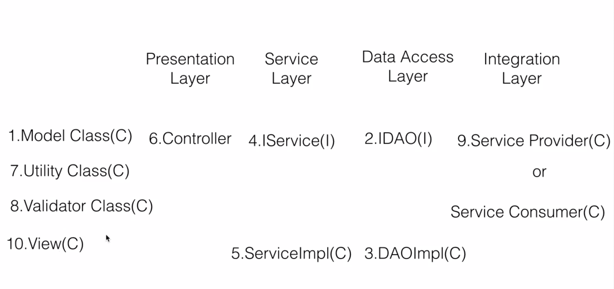

# Spring Boot Documentation

Key concepts:

- Maven: 

- Microservice: It is a small autonomous service which can be built and deployed on it's own, independent of other services. And each microservice will expose an API, and will communicate with other microservices through network api calls.
  - Advantages of Microservices:
      - Heterogenous: Each microservice is independent of the other micorservices, hence can use different technologies like, Jave, .Net, Python, etc
      - Robustness: When one if the microservices goes down, rest can still function, hence if Functinality XYS microservice goes down, then, 
      - Scalable: Individually scalable based on requirement for each service
      - Easy to deploy: we can deploy only the microservice which has a new update
      - Easily Reusable and replacable of each service

- Layers and Classes of microservices

- [Spring Boot - JPA - MYSQL - Hibernate](https://www.callicoder.com/spring-boot-rest-api-tutorial-with-mysql-jpa-hibernate/)
